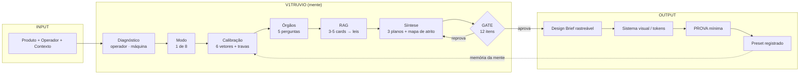
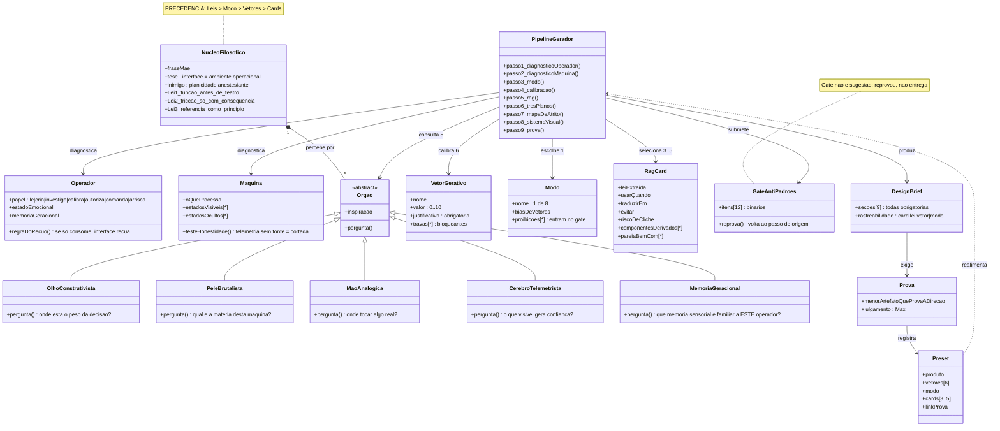
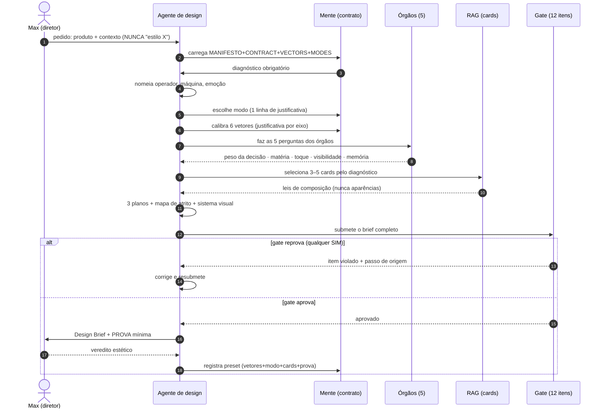
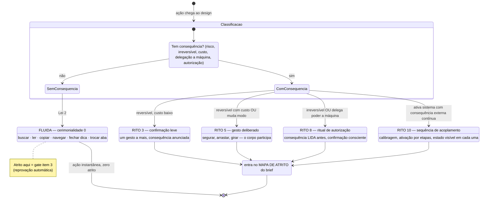
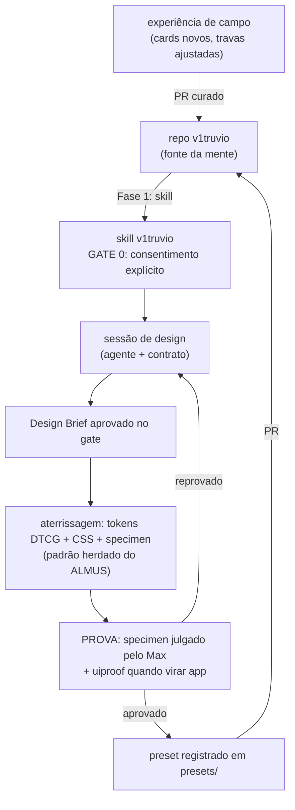

# MIND-UML — A arquitetura cognitiva do V1TRUVIO

O UML mental completo: como a mente é composta (classes), como ela gera (sequência), como ela decide rito (estados) e como ela aprende (ciclo de vida). Os diagramas são a especificação — o [CONTRACT.md](../mind/CONTRACT.md) é a implementação em prosa.

---

## 1. Visão geral — o compilador

**Leitura:** estilo nunca entra; entra produto+operador. O gate devolve para a síntese, não para o lixo. O preset aprovado realimenta calibrações futuras — é o único mecanismo de aprendizado da mente.

---

## 2. Diagrama de classes — a anatomia

**Invariantes de classe:**

| # | Invariante | Onde é imposta |
|---|---|---|
| I1 | Nenhum passo do pipeline pula o anterior | CONTRACT (seções obrigatórias) |
| I2 | Vetor sem justificativa invalida a geração | VECTORS |
| I3 | Card entra por lei, nunca por aparência | Lei 3 + gate item 5 |
| I4 | Atrito fora do mapa é bug, não feature | Lei 2 + gate itens 3–4 |
| I5 | Identidade sem prova não existe | Passo 9 |
| I6 | Preset só nasce de geração aprovada E provada | CONTRACT (registro) |

---

## 3. Diagrama de sequência — uma geração

---

## 4. Máquina de estados — atrito e cerimônia

O coração da Lei 2: **como uma ação recebe (ou não) rito.**

---

## 5. Ciclo de vida — deploy e aprendizado

**Regra do ciclo:** a mente só muda por PR no repo (curadoria) — nunca por drift de sessão. O que a sessão aprende e quer ensinar à mente vira PR de card, trava ou preset; o resto morre com a sessão.
